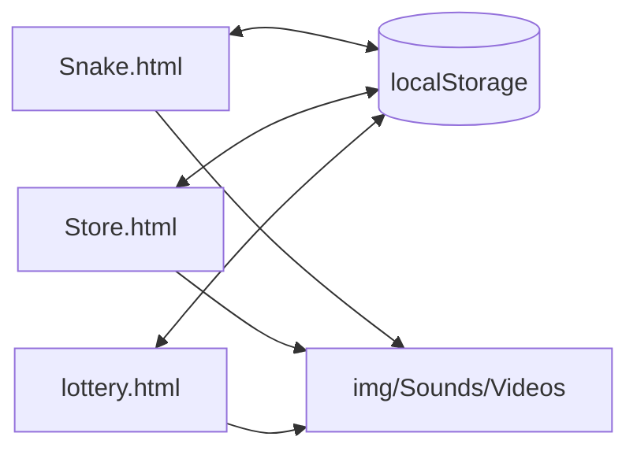

# 架构设计

## 总体架构
- **单体静态前端**：每个页面自包含 HTML/CSS/JS
- **数据持久化**：使用 `localStorage` 在页面间共享数据
- **资源加载**：图片/音频/视频由相对路径加载

```mermaid
flowchart LR
  Snake[Snake.html] <--> LS[(localStorage)]
  Store[Store.html] <--> LS
  Lottery[lottery.html] <--> LS
  Snake --> Assets[img/Sounds/Videos]
  Store --> Assets
  Lottery --> Assets
```

## 关键关注点
- UI/样式应尽量共享，减少三页重复
- 移动端/横屏布局需要响应式断点
- 外部资源（字体/CDN）需提供可回退方案（无网络时仍可用）